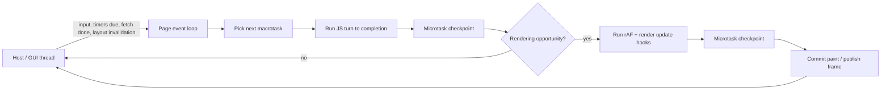

# Engine Async Design (Draft)

Status: draft for PM review. Do not implement from this document without review.

## Purpose

Phase 5 needs a live event loop that behaves like a browser main thread, not a batch settle pass.

This document sketches the intended model for:

- macrotasks
- microtasks / Promise jobs
- timers
- `requestAnimationFrame`
- Mutation/Resize/Intersection observers
- host-driven network completion

## Current Problem: `settle_pending_state`

Today, `src/js.rs` works by repeatedly draining queues until they appear quiescent:

- top-level script eval
- `context.run_jobs()`
- pending timeout / interval / rAF callbacks
- completed `fetch` resolutions
- observer flush helpers

That is a pragmatic workaround for a runtime that does not stay alive after load, but it is not the browser model:

- timers are not tied to real elapsed time
- network completion is pulled during settle rather than entering from the host loop
- rendering ticks are emulated as just another flush pass
- "keep settling until nothing changed" is not how HTML event loops work

Phase 5 replaces this with a persistent loop.

## Goals

- One page has one live JS main-thread agent while it is open.
- The host drives time, input, frame opportunities, and completed async work.
- Promise jobs and `queueMicrotask` drain at microtask checkpoints.
- Timers are based on monotonic clock time.
- `requestAnimationFrame` runs on rendering opportunities, before paint.
- Mutation, resize, and intersection delivery points follow spec shape closely enough to match browser ordering on real pages.

## Non-Goals for the First Iteration

- compositor-thread architecture
- display-refresh-perfect frame pacing
- background-tab throttling parity
- worker threads / worker event loops
- service-worker integration

## Proposed Runtime Topology



### Threading

Recommended first implementation:

- GUI / host thread owns wall clock, input, completed network messages, and paint submission.
- JS worker thread owns the page VM and its task queues.
- Cross-thread communication uses explicit event messages, not re-entrant settle loops.

This keeps JS execution single-threaded while allowing page load, network, and UI wakeups to remain live.

## Queue Model

### Macrotask queues

Maintain explicit task sources instead of one undifferentiated FIFO:

- user interaction task source
- timer task source
- networking task source
- history/navigation task source
- DOM manipulation / custom host task source
- rendering task source
- intersection observer task source

Ordering rule:

- preserve FIFO within a task source
- do not promise a global "oldest task across all sources" rule; cross-source selection stays implementation-defined
- the engine should therefore model task sources explicitly and validate observable ordering with browser-diff regression tests instead of baking in stricter guarantees than the HTML model

### Microtask queue

One microtask queue per page agent for:

- Promise reaction jobs
- `queueMicrotask`
- MutationObserver notification microtasks
- any internal engine cleanup jobs that must run with Promise-job priority

Microtask checkpoint rule:

1. Run after each macrotask completes.
2. Keep draining until the queue is empty.
3. If a microtask queues more microtasks, continue draining in-order.
4. Promise jobs must run in the same order they were enqueued.

This matches the ECMAScript host requirement that `HostEnqueuePromiseJob` preserve enqueue order and the HTML model that performs microtask checkpoints between tasks.

## Event Loop Skeleton

```text
loop while page is alive:
  ingest host events that became ready
  if an eligible macrotask exists:
    run one macrotask to completion
    perform microtask checkpoint
    if render requested and a rendering opportunity exists:
      run animation frame callback stage
      allow callback-boundary microtask checkpoints
      refresh style/layout state
      run ResizeObserver delivery loop
      compute and queue IntersectionObserver work
      publish paint
  else:
    block until next host event or timer deadline
```

Important consequence:

- we never "spin until the world settles"
- we always return to a wait state when no work is ready

## Timers

### Scheduling

Implement `setTimeout` / `setInterval` off a monotonic clock.

Store:

- timer id
- owning window/document
- due time
- repeat interval if repeating
- timer nesting level

### Semantics

- negative delays clamp to `0`
- nested timers clamp to at least `4 ms` after nesting level exceeds `5`
- interval timers reschedule from firing time/algorithmic repeat, not by recursive immediate enqueue
- canceled timers are removed before execution

When a timer becomes due, the host queues a timer macrotask for the page.

## Promise Jobs and `queueMicrotask`

- Promise settlement must enqueue jobs, never run handlers inline.
- `queueMicrotask` must enter the same microtask queue used by Promise reactions.
- `async` / `await` lowering must resume via Promise jobs, not via timer-style tasks.

Observable requirement:

- `Promise.resolve().then(...)` and `queueMicrotask(...)` both run before the next timer macrotask once the current macrotask completes.

## `requestAnimationFrame`

### Registration

- `requestAnimationFrame` stores a one-shot callback in a document/window-owned callback map.
- `cancelAnimationFrame` removes it.

### Delivery

- rAF callbacks run only during a rendering opportunity.
- they receive the frame timestamp for that render opportunity.
- all callbacks captured for the frame run before paint.
- newly scheduled rAF callbacks go to a later frame, not the current frame.
- rAF callbacks should run before the frame's style/layout refresh and before ResizeObserver delivery.

Recommended first cut:

- fixed host-driven frame clock, for example 60 Hz, while the page is visible
- later optimize for real display pacing and suppression when nothing is dirty

## Observer Delivery

### MutationObserver

- DOM mutations queue mutation records immediately.
- the first mutation in a turn queues a MutationObserver microtask.
- delivery happens during the next microtask checkpoint.

That keeps MutationObserver in the same microtask phase as browsers.

### ResizeObserver

- resize observation depends on fresh layout data.
- delivery belongs to the rendering/update stage, not the Promise microtask queue.
- callbacks fire after fresh layout state exists for the frame and before paint.
- Promise jobs queued by a ResizeObserver callback must not be deferred until "after the whole frame" if earlier callback boundaries already permit a microtask checkpoint.

Implementation note:

- if ResizeObserver callbacks cause more layout-affecting writes, limit recursive resize delivery the same way browsers guard resize loops.

### IntersectionObserver

- visibility changes are computed from layout/scroll/viewport updates.
- the rendering/update stage computes observations and queues entries.
- notifications are then queued onto the IntersectionObserver task source.
- callbacks therefore run later as macrotasks, not as microtasks and not inline with the render step itself.

This is deliberately different from MutationObserver and must stay different.

## Network Completion

`fetch` / XHR should not be resolved by a settle loop.

Instead:

1. JS creates a pending engine-side request record.
2. Host/network worker performs I/O.
3. Completion message is posted back to the page event loop.
4. The page enqueues a networking macrotask.
5. That macrotask resolves or rejects the associated Promise/XHR state.
6. Promise reactions then run at the following microtask checkpoint.

This separation is important for browser-like ordering.

## Navigation / History

- `location.href = ...` and full navigations should request host navigation work and end the current turn normally.
- `pushState` / `replaceState` are synchronous state mutations.
- `popstate` and `hashchange` enter from host/history task scheduling, not from settle recursion.

## Render / Layout Integration

Phase 5 does not require moving layout fully into the JS engine, but it does require a clear handshake:

1. DOM/style mutations mark layout as dirty.
2. The host decides when a rendering opportunity exists.
3. During the rendering task, rAF callbacks run first.
4. After the relevant callback boundary checkpoints, the host refreshes layout-dependent data.
5. ResizeObserver delivery uses that fresh state before paint.
6. IntersectionObserver uses that same fresh state only to compute and queue later tasks.
7. Paint publishes the new frame.

This is what replaces the current snapshot/reparse style of "run JS, then rebuild until calm".

## Why This Replaces `settle_pending_state`

Old model:

- run script
- drain every queue
- if something else was produced, drain again
- stop when no more work appears

New model:

- host posts ready work over time
- the VM runs one turn
- microtasks drain
- optional render stage runs
- the page sleeps until more work is ready

That is both more spec-shaped and more scalable for long-lived pages.

## Open Questions For Review

- Should the first Phase 5 implementation use one FIFO plus task-source tags, or truly separate per-source queues?
- How aggressively should Tobira throttle render ticks for idle pages before visibility/state APIs exist?
- Do we want ResizeObserver loop protection in the first Phase 5 cut or immediately after?
- Should XHR completion share the same networking task source as `fetch`, or keep a distinct source for easier debugging?

## Reference Shape

This draft is based on the browser/ECMAScript model described by:

- HTML Standard event loops and rendering opportunities: <https://html.spec.whatwg.org/multipage/webappapis.html>
- HTML Standard timers: <https://html.spec.whatwg.org/multipage/timers-and-user-prompts.html>
- HTML Standard animation frames: <https://html.spec.whatwg.org/dev/imagebitmap-and-animations.html#animation-frames>
- ECMAScript `HostEnqueuePromiseJob`: <https://tc39.es/ecma262/multipage/executable-code-and-execution-contexts.html#sec-hostenqueuepromisejob>
- DOM Standard MutationObserver microtasks: <https://dom.spec.whatwg.org/>
- Resize Observer processing model: <https://www.w3.org/TR/resize-observer/>
- Intersection Observer task source: <https://www.w3.org/TR/intersection-observer/>
